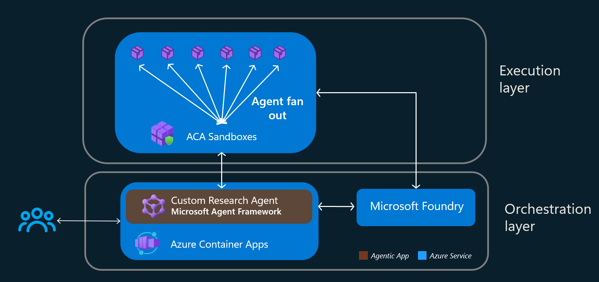

# Research Agent Fan-out on Azure Container Apps Sandboxes

Submit a topic and multiple isolated agents researches it in parallel. The orchestrator breaks the topic into sub-questions, spawns one sandbox per question to research each independently, then synthesizes a single report. Built with the [Microsoft Agent Framework](https://github.com/microsoft/agent-framework) and Microsoft Foundry (gpt-5-mini).

## Azure Container Apps Sandboxes

[Azure Container Apps Sandboxes](https://sandboxes.azure.com) give each agent its own isolated microVM with sub-second provisioning, snapshots, and default-deny egress control. In this demo, every sub-question runs in a fresh sandbox created from a cached disk image. Each sandbox is locked down with a default-deny egress policy that allows the Foundry and Azure OpenAI endpoints plus Application Insights telemetry endpoints when telemetry is configured. Other destinations remain blocked. Sandboxes are created on demand, polled for their result, and deleted when the work is done.

## Architecture



| Folder | Component | Role |
|---|---|---|
| `orchestrator/` | FastAPI + Microsoft Agent Framework | Hosts the workflow, the WebSocket UI, and the sandbox lifecycle |
| `research-agent/` | Flask + Microsoft Agent Framework | Runs inside each sandbox and researches one sub-question via Foundry web search |
| `infra/` | Bicep | Provisions ACR, Azure OpenAI / Foundry, Application Insights, the ACA environment, the sandbox group, and the orchestrator app |

The orchestrator decomposes the topic (gpt-5-mini), fans out one sandbox per sub-question, fans the answers back in, and synthesizes the final report. Progress streams live to the browser over a WebSocket.

Use the header's theme toggle to switch between light and dark mode. The UI follows your system preference until you choose a theme, then remembers that choice in your browser.

Both tiers are instrumented with OpenTelemetry and export to Application Insights, so agent runs, tool calls, and sandbox lifecycle operations appear as correlated distributed traces (one trace spans the orchestrator and every research agent).

Sandbox telemetry egress is derived from `APPLICATIONINSIGHTS_CONNECTION_STRING`, including ingestion/live endpoint defaults and `EndpointSuffix` / `Location`. Public Azure Monitor regional ingestion and live-diagnostics hosts are allowed for redirects and exporter health metrics; custom collectors get exact-host rules. No telemetry exceptions are added when the connection string is unset. Redeploy the orchestrator for this policy to apply to newly created sandboxes. The `POST /api/sandbox/egress-probe` diagnostic includes telemetry connectivity checks and the sandbox's allowed/denied audit entries; an HTTP error response alone does not prove an egress denial or successful telemetry ingestion.

## Deploy to Azure

Prerequisites: [Azure CLI](https://learn.microsoft.com/cli/azure/install-azure-cli) (`az login`), the [Azure Developer CLI](https://learn.microsoft.com/azure/developer/azure-developer-cli/install-azd) (`azd`), Docker, and a subscription with quota for Azure OpenAI (gpt-5-mini), Azure Container Apps, and Azure Container Registry.

The orchestrator pins `azure-containerapps-sandbox==0.1.0b4` in [requirements.txt](orchestrator/requirements.txt) so local installs and container builds use the same SDK release.

```bash
azd up
```

One command provisions `infra/`, builds and pushes both images, deploys the orchestrator, and prints its public URL. Open the URL and submit a topic.

Day-2 commands:

```bash
azd deploy      # redeploy the orchestrator code only
azd provision   # re-run the Bicep
azd down        # tear everything down
```

## Run locally

Sandboxes always run in Azure, but you can run the orchestrator on your machine against the Azure-hosted sandbox group. Deploy the infra once (`azd provision` or `azd up`) so the sandbox group, ACR, Foundry, and the research-agent image exist.

```bash
cd orchestrator
python -m venv .venv
# Linux/macOS: source .venv/bin/activate
# Windows:     .\.venv\Scripts\Activate.ps1
pip install -r requirements.txt

cp .env.example .env    # fill in values from the deployment outputs
python orchestrator.py
```

Because you authenticate as yourself locally, grant your user the same two roles the orchestrator's managed identity has in Azure: `Dev Compute SandboxGroup Data Owner` on the sandbox group and `Cognitive Services OpenAI User` on the Azure OpenAI account. Then open http://localhost:5000 and submit a topic.
